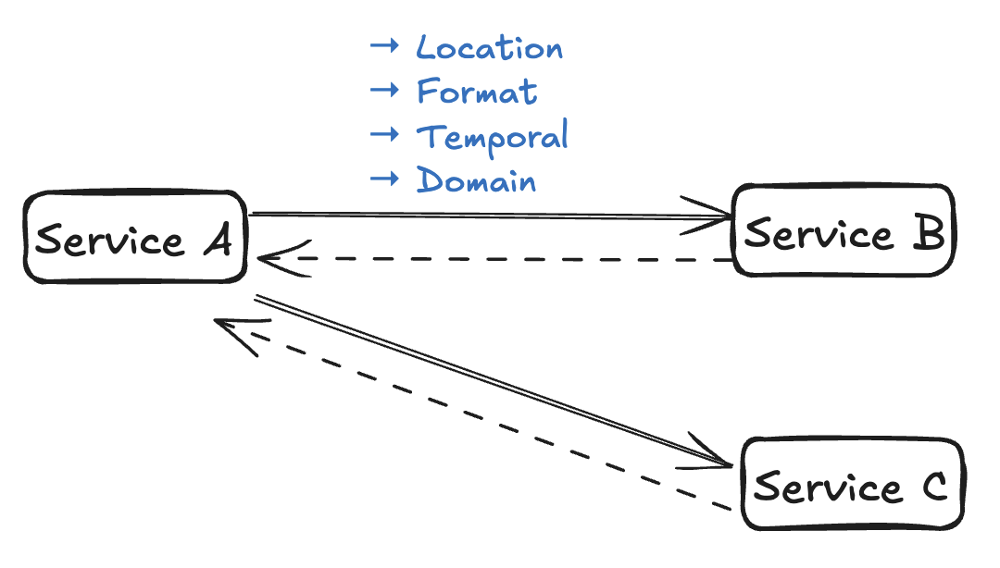
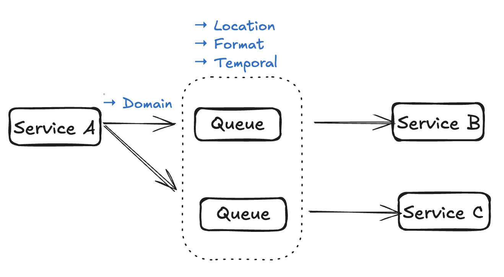
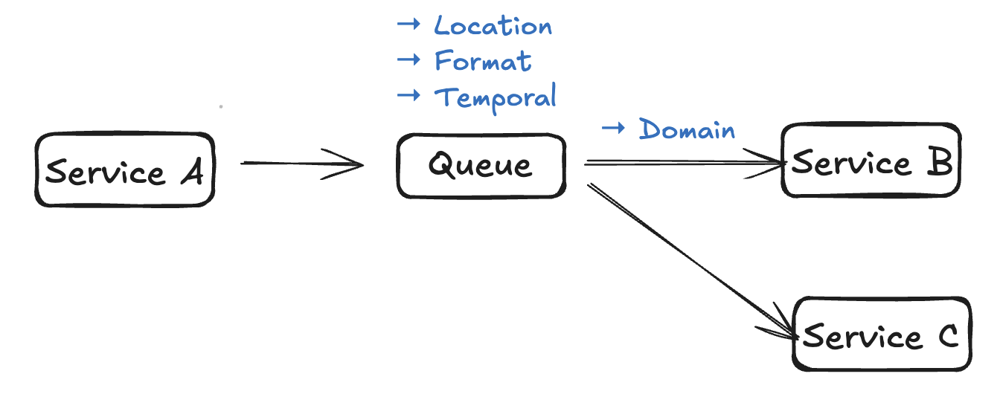

### How to communicate?
If you want to communicate with humans, watch this [Think Fast, Talk Smart: Communication Techniques](https://www.youtube.com/watch?v=HAnw168huqA) but today we are going to talk about computers.
#### Why do we need communication?
We have information in one system and want to send it across to another. For example order service knows that a customer placed an order and has to inform the payment service.

##### Think about these before choosing your favourite option:
1. Coupling:
    - Location coupling (URL)
    - Format coupling (JSON/XML/Avro)
    - Temporal coupling (Both services need to be available at the same time)
    - Domain coupling (Business logic)
2. Control flow:
    - Push
    - Pull
3. Do we need synchronous response?
#### Option 1: Request response

- Coupled on all of the dimensions.
- Supports both push and pull control flow. This should be decided based on the latency and scaling dimensions.
- Asynchronous request-response can be used when the caller does not need to block waiting for the response.

#### Option 2: Message Queue

- Shifts location, format and temporal coupling to the queuing system
- Domain coupling is on producer side because it needs to decide what domain model downstream system requires.
- Control flow is push on both producer and consumer (with few gotchas) side.

##### What if consumer is slower than producer?
Guess what we need flow control. We have 3 options: drop the message, TTL on message or backpressure on producer

We can shift domain coupling from producer to consumer using topics instead of queues, producer just generates the event and now consumers need to make something out of it and do whatever is needed.

Read [this](../system-design/queues.md) to know more about queues and topics.

#### References
[AWS re:Invent 2025 - Integration patterns for distributed systems](https://www.youtube.com/watch?v=xc9P6wbhLwE)
